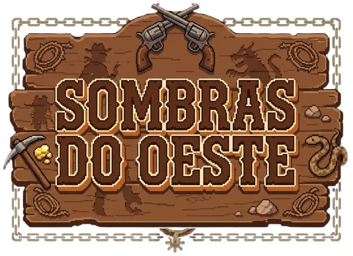

# Sombras do Oeste


Um jogo de sobrevivência em ondas ambientado no velho oeste, feito em **HTML, CSS e JavaScript puro**. Enfrente bandidos, monstros e uma maldição amaldiçoada enquanto avança rumo a uma mina lendária cheia de ouro — e de segredos.

---

## História

Você é um caçador de recompensas que nunca recusa um trabalho. Um contratante misterioso oferece uma fortuna por uma missão simples: confirmar se uma mina lendária realmente existe. Vários exploradores desapareceram tentando encontrá-la — mesmo assim, você aceita.

Ao longo do caminho — passando pela cidade, pelo deserto, pelo cânion e pela entrada da mina — o perigo aumenta a cada fase. Apenas nas profundezas da mina a verdade é revelada. Jogue e descubra por que ninguém jamais voltou de lá. Você está disposto a pagar um preço sombrio por essa resposta?

---

##  Como jogar

### Controles
| Ação | Tecla |
|---|---|
| Mover | `WASD` ou setas |
| Atirar | Mouse ou `Barra de espaço` |

### Objetivo
- Eliminar inimigos para ganhar pontos
- Coletar moedas para melhorar equipamentos e skins na loja
- Desviar de obstáculos
- Avançar de fase até enfrentar o chefão (guardião da mina)

### Loja / upgrades
Entre fases, gaste suas moedas em:
- Armas: Revólver, Pistola
- Novos Personagens
- Trilhas Sonoras Épicas

---

## Fases

| # | Fase | Período | Inimigos | Pontos p/ passar de Fase |
|---|---|---|---|---|
| 1 | A cidade | Manhã | Bandidos comuns, Xerifes, Bolas de feno | 40 |
| 2 | Deserto | Meio-dia | Bandidos a cavalo, Coiotes, Pistoleiros Fantasma | 80 |
| 3 | Cânion | Entardecer | Abutres, Cavalos esqueleto, Camelos Zumbi | 120 |
| 4 | Entrada da mina | Noite | Mineiros zumbis, Mineiros esqueletos, Camelo zumbi | 160 |
| 5 | Chefão | — | Guardião da mina | 200 |

A dificuldade aumenta progressivamente: inimigos resistentes a cada fase.

## Modo Multiplayer

Duelo local entre dois jogadores:
1. Jogadores nascem lado a lado do mapa
2. Coletam itens (vidas caem do céu — quem pega primeiro leva)
3. Vençam juntos e não gastem suas vidas
---

## Direção de arte

- Estilo visual de velho oeste
- Cores fortes durante o dia (laranja/amarelo)
- Tons frios à noite (azul/roxo)
- Cenários: deserto aberto, cidade, mina, cânion

---
### Link do Vercel: `https://jogo-faroeste.vercel.app/`
---

## Estrutura do projeto

```
jogo_faroeste/
├── index.html            # Tela inicial / menu
├── index.js
├── html/                 # Demais telas (intro, jogo, loja, sobre, desenvolvedores)
├── css/                  # Estilos de cada tela
├── js/                   # Lógica do jogo (intro.js, jogo.js, loja.js, musica.js)
├── models/               # Classes (Player, Player2, Monstro, Chefao)
├── img/                  # Sprites e cenários
├── music/                # Trilha sonora
├── efeitos_sonoros/      # Efeitos sonoros (tiros, ações)
├── video/                # Vídeo da tela inicial
└── diagrama_UML/         # Diagrama UML do projeto
```

---

## Como rodar

Este projeto é 100% front-end (HTML/CSS/JS), sem dependências ou processo de build. Basta:

1. Baixar/clonar a pasta do projeto
2. Abrir `index.html` em um navegador **ou** servir a pasta com um servidor local (recomendado, para vídeo e áudio funcionarem sem problemas de CORS), por exemplo:
   ```bash
   npx serve .
   # ou
   python3 -m http.server 8000
   ```
3. Acessar `http://localhost:8000` (ou a porta indicada) no navegador

---

## Regras e Requisitos

### Regras de Negócio
- Progressão de Fases:
   - Velocidade ou quantidade dos inimigos **aumenta**
   - Mudanças de cenário
- Só vencer o jogo se tiver no **mínimo** 1 vida no final, senão deve chamar a tela de derrota
- Tela de **manual** explicando teclas, pontuação, vidas, etc
- 3 fases

### Requisitos Funcionais
- Controle da **movimentação** do jogador nos eixos X ou Y
- Sistema de **vidas** (começa com vidas e perde ao colidir com inimigo)
- Sistema de **pontuação**
- Items **coletáveis** que recuperam vida ou aumentam pontuação
- Progressão de 3 **fases** após meta de pontos ou tempo
- Interface: 
   - Tela Inicial
   - Jogo
   - Sobre
      - Desenvolvedores e Product Owner
   - Tela de Vitória
   - Tela de Derrota

### Requisitos Não Funcionais
- **Tecnologia** (O sistema deve ser desenvolvido utilizando
JavaScript, garantindo que o código seja compatível com
navegadores modernos sem a necessidade de “transpilação”
complexa para execução básica)
- **Portabilidade** (O jogo deve “rodar” diretamente no
navegador (HTML5/Canvas))
- **Usabilidade** (A interface do usuário deve ser projetada
com foco exclusivo no em computadores, utilizando a resolução
de 1920 x 1080 px. O layout deve garantir que todos os
elementos (inputs, botões e tabelas) estejam visíveis e operáveis
dentro desta área de visualização sem cortes indesejados)
- **Desempenho** (O jogo deve
manter uma taxa de atualização de quadros estável (ex: 60 FPS
com requestAnimationFrame) para garantir fluidez)

### Documentação e Modelagem
- Diagrama de Caso de Uso
- Diagrama de Classe
- Diagrama de Sequência
---
##  Tecnologias

- HTML5
- CSS3
- JavaScript (vanilla)

---

## 👥 Créditos
- Carlos Roberto da Silva Filho - Product Owner - `https://github.com/Prof-Carlos-Senai`
- Pietro Francio de Miranda - Scrum Master `https://github.com/pietrofrancio`
- Gabriela Mezzadri Rankel - Desenvolvedora `https://github.com/gabrielaRankel`
- Clarice Heitmann Santos - Desenvolvedora `https://github.com/clariceheitmann`
- Paula Ferreira Coutinho - Desenvolvedora `https://github.com/paulactnh`


Desenvolvido em equipe — veja a tela "Desenvolvedores" (`html/desenvolvedor.html`) dentro do jogo para mais detalhes sobre a equipe.
